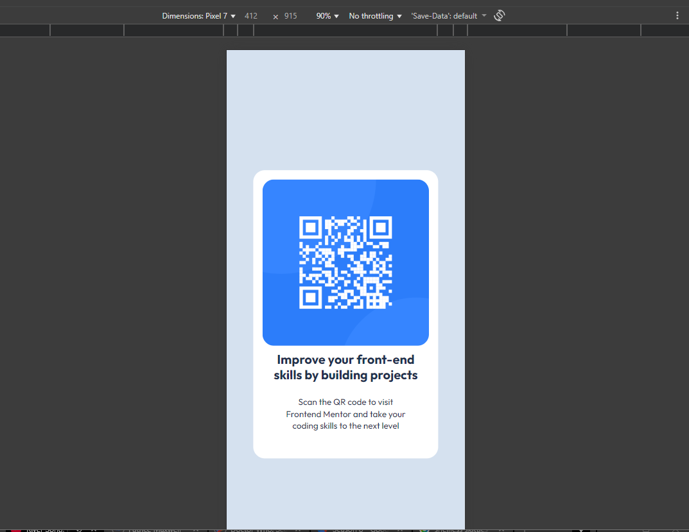
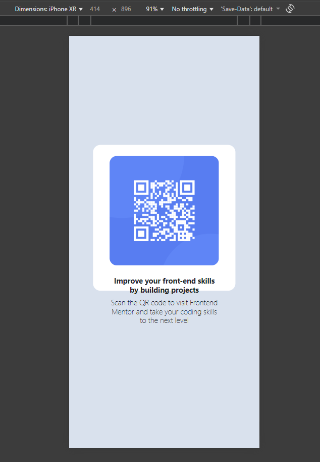

## Table of contents

- [Overview](#overview)
  - [Screenshot](#screenshot)
- [My process](#my-process)
  - [Built with](#built-with)
- [Author](#author)

## Overview

Lab 2 : Practicing Implementation with Frontend Mentor

Scenario:
 In a professional setting, developers often work from detailed Figma designs to build high-quality, pixel-perfect web components. To strengthen your development skills, this lab will introduce you to Frontend Mentor, a tool providing real-world coding challenges. Frontend Mentor will help you practice translating Figma designs into HTML and CSS and give you a taste of professional front-end development workflows. The hands-on challenges will enhance your proficiency with core web development tools and refine your ability to implement design specifications accurately.

### Screenshot

## My process

### Built with

- Semantic HTML5 markup
- CSS custom properties
- Flexbox
- Mobile-first workflow

## Author

 Rice 🍚 
 ([thegrainofrice.com](https://www.thegrainofrice.com/))
 ([Linkedin](https://www.linkedin.com/in/patrice-maxwell))

